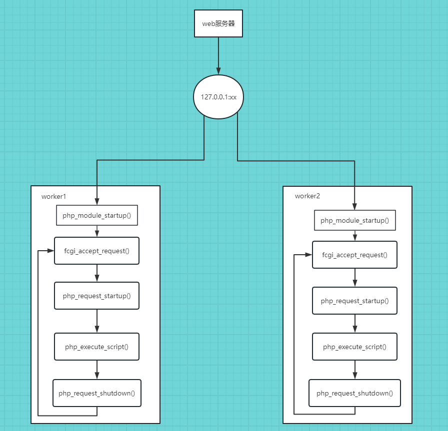

接下来看看 PHP-FPM 这个 SAPI 的生命周期。

# PHP-FPM生命周期

首先，初始化信号集。

接着调用 sapi_startup，初始化 FPM 这个SAPI。

接着，初始化 fgci。

接着，调用 cgi_sapi_module.startup=>php_cgi_startup=>php_module_startup 进行模块初始化。
跟 CLI 一样，在模块初始化阶段，执行了如下步骤：

    1. 初始化 _sapi_globals_struct；
    2. 初始化 gc_globals；
    3. 初始化 zend引擎公共函数，初始化内存管理，启动扩展机制，设置zend内部函数和值（如编译器、执行器、垃圾收集器），初始化zend vm，初始化zend ini，初始化 zend 优化器
    4. 注册常量，如PHP_VERSION、PHP_OS
    5. 初始化php.ini、zend ini并加载 zend 扩展、注册php扩展函数，初始化超全局变量的handler
    6. 加载并注册内置扩展
    7. 加载外部 PHP 扩展
    8. 注册ini设置的扩展
    9. 启动 zend 模块
    10. 启动 zend 扩展
    11. 禁用 ini 设置的函数、类

接着，调用 fpm_init 进行 FPM 初始化，初始化 FPM 的 fpm_globals 以及相关操作。

接着。调用 fpm_run 运行 FPM，在这里，会 fork 出若干个子进程，在后文中具体分析。而因为会 fork，所以在这里，父进程进入循环阻塞，而子进程则继续后面操作。
在子进程中，fpm_run 返回一个**监听的 socket**。

接着，在子进程中，将前面获取的 socket 传到 fpm_init_request 进行请求初始化。

接着，调用 fcgi_accept_request，里面是一个死循环，阻塞接收fcgi请求。

在接收完请求后，初始化 request_info，之后调用 php_request_startup 进行请求初始化。

然后，得到入口文件，并调用 php_execute_script 执行 PHP 脚本。

脚本执行完毕后关闭请求。

## fpm_run 发生了什么

给各个 worker 池创建子进程。（PHP在不同的监听端口和不同的管理选项下可以跑任意数量的池）

调用 fpm_children_make，fork 出每个池所设定的子进程数量，然后调用 fpm_child_init 初始化子进程，进行如设置**监听 socket**、初始化信号等操作。

子进程fork完毕后，会返回**监听的 socket**，而父进程则进入**事件循环**，进行 FPM 的事件监听并触发。

# 总结

FPM 模式下，可以根据监听的端口号不同，FPM监听多个进程池，在每个进程池中，FPM fork 出多个子进程，每个子进程独立的接收 fcgi 发送过来的请求，然后进行解析、执行。

